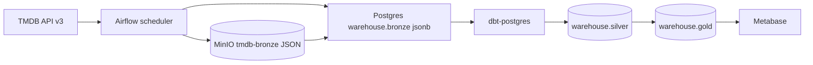

# TMDB ELT Pipeline Demo App with Medallion Architecture

Local demo of an **ELT** pipeline on The Movie Database (TMDB) REST API v3.

Bronze is **raw**. Silver and gold are **transformed**. Nothing is cleaned in Airflow extract — dbt does the typing and marts.



## Stack (all local Docker Compose)

| Service | Role | UI / port |
|---|---|---|
| `postgres` | Airflow metadata (`airflow`) + warehouse (`warehouse`) | `localhost:5432` |
| `minio` | S3-compatible object store | API `9000`, console `9001` |
| `airflow-webserver` / `airflow-scheduler` | Orchestration, LocalExecutor | `http://localhost:8080` |
| `metabase` | BI on `gold` | `http://localhost:3000` |
| dbt-core + dbt-postgres | Silver + gold transforms (runs inside Airflow) | — |

No Kubernetes, Terraform, Spark, or streaming in v1.

## Medallion layers

| Layer | What is stored | Where |
|---|---|---|
| **Bronze (raw)** | Unmodified TMDB JSON plus request sidecars | MinIO `s3://tmdb-bronze/tmdb/{resource}/ingest_date=YYYY-MM-DD/run_id={id}/...` and Postgres `bronze.raw_payloads` (`payload jsonb`) + `bronze.ingest_objects` |
| **Silver (conformed)** | Typed, deduped 3NF-ish tables, natural TMDB ids | `warehouse.silver` — `movie`, `person`, `genre`, `company`, `country`, `language`, `keyword`, credits and bridges |
| **Gold (analytics)** | Denormalized star-schema marts | `warehouse.gold` — `dim_movie`, `dim_person`, `dim_genre`, `dim_company`, `dim_keyword`, `dim_date`, `fact_movie`, `fact_movie_cast`, `fact_movie_crew`, genre/company bridges, plus wide `movie_analytics` |

`movie_analytics` is the Metabase-friendly table: `genre_list`, `top_3_cast`, `primary_company`, `profit` (`revenue - budget`), `roi` (null when `budget = 0`).

### TMDB resources (v1)

- `GET /genre/movie/list`
- paginated `GET /movie/popular` and `GET /movie/top_rated` (Airflow Variable `tmdb_pages`, default 5)
- `GET /movie/{id}` details
- `GET /movie/{id}/credits`
- `GET /movie/{id}/keywords`
- `GET /person/{id}` for people in ingested credits (bounded; Variable `tmdb_max_people`, default 200)
- optional reference (not extracted in v1): configuration languages/countries — ISO codes instead come from movie `spoken_languages` / `production_countries`

Field names match the official API. Do not expect invented columns.

## Walkthrough (15 minutes)

1. Copy env and set a real TMDB v3 key ([API settings](https://www.themoviedb.org/settings/api)):

   ```bash
   cp .env.example .env
   # edit .env → TMDB_API_KEY=...
   ```

2. Start the platform (first boot builds the Airflow image and runs `airflow-init`: migrate DB, create admin, warehouse + MinIO connections, Variables `tmdb_pages` / `tmdb_max_people`):

   ```bash
   docker compose up -d --build
   ```

   Or `./scripts/demo.sh` / `make up`. Wait until `airflow-webserver` is healthy.

3. Open the UIs:
   - Airflow [http://localhost:8080](http://localhost:8080) — user `admin` / password `admin` (from `.env`)
   - MinIO console [http://localhost:9001](http://localhost:9001) — `MINIO_ROOT_USER` / `MINIO_ROOT_PASSWORD`
   - Metabase [http://localhost:3000](http://localhost:3000) — create an admin on first visit
   - Postgres `localhost:5432` — databases `airflow` and `warehouse`

4. Trigger bronze (DAGs start unpaused; silver and gold follow via Airflow Datasets):

   ```bash
   docker compose exec airflow-scheduler airflow dags trigger dag_tmdb_bronze
   ```

   Or use the Airflow UI **Trigger DAG** on `dag_tmdb_bronze`.

5. Wait until `dag_tmdb_bronze` → `dag_tmdb_silver` → `dag_tmdb_gold` are success. Bronze can take several minutes (rate-limited TMDB calls).

6. Open Metabase at [http://localhost:3000](http://localhost:3000):
   - Create the admin account.
   - **Add a database** → PostgreSQL:
     - Host: `postgres` (Metabase runs in Docker; **not** `localhost`)
     - Port: `5432`
     - Database name: `warehouse`
     - Username / password: `POSTGRES_USER` / `POSTGRES_PASSWORD` from `.env` (`tmdb` / `tmdb` by default)
   - Browse `gold.movie_analytics` or paste a query from `analytics/example_questions.sql`.

## Example gold metrics

- Average `vote_average` by genre (`bridge_movie_genre` + `fact_movie`)
- Revenue vs budget by release year
- Most-credited actors (`fact_movie_cast`)
- Unprofitable titles (`movie_analytics.profit < 0`)
- Top ROI where `budget > 0`
- Crew department distribution
- Companies by total revenue
- Original-language mix

## Airflow DAGs

| DAG | Schedule | Does |
|---|---|---|
| `dag_tmdb_bronze` | `@daily` + manual | Extract → MinIO → catalog jsonb. Emits dataset `warehouse://bronze`. |
| `dag_tmdb_silver` | dataset bronze | `dbt run` + `dbt test` for silver. Fails the run if tests fail. |
| `dag_tmdb_gold` | dataset silver | `dbt run` + `dbt test` for gold. |

Airflow connections created at init: `warehouse_postgres`, `minio_s3`. TMDB key is `TMDB_API_KEY` (never logged).

### Connections (already created)

- Postgres warehouse: host `postgres`, db `warehouse`
- MinIO/S3: endpoint `http://minio:9000`, keys from `.env`

## Make / scripts

```bash
make up              # compose up --build
make down
make trigger-bronze
make logs
make test            # unit tests (no Docker)
./scripts/demo.sh    # env check, up, wait for Airflow health
```

## Layout

```text
README.md
docker-compose.yml
Dockerfile.airflow
.env.example
airflow/dags/
src/                 # tmdb client, MinIO landing, bronze catalog
dbt/                 # silver + gold
scripts/
analytics/example_questions.sql
```

## Troubleshooting

**TMDB 429 / rate limit**  
The client retries with backoff and spaces requests (~0.26s). Lower `tmdb_pages` / `tmdb_max_people` in Airflow Variables or `.env`, then re-trigger bronze.

**Missing API key**  
Bronze fails with `TMDB_API_KEY is missing`. Copy `.env.example` → `.env`, set a real key, `docker compose up -d` so Airflow picks up the env, trigger again. Never put the key in DAGs.

**Empty popular list**  
Usually a bad/missing key, TMDB outage, or `tmdb_pages=0`. Check the extract task logs (the key is redacted).

**MinIO credentials / image pull**  
Default `minioadmin` / `minioadmin`. Console: [http://localhost:9001](http://localhost:9001). If you changed `.env` after the first `up`, named volumes still have the old keys — `docker compose down -v` (wipes data) and up again. Community MinIO images are pulled from `quay.io/minio/*` (Docker Hub no longer serves them).

**Airflow UID / permissions**  
`.env` has `AIRFLOW_UID=50000` (image user). Logs use a named volume, dbt writes to `/tmp` in the container. If the webserver will not start on Linux, set `AIRFLOW_UID=$(id -u)`.

**Postgres health / warehouse missing**  
Init SQL runs only on an empty volume. If you started Postgres before the init script existed, `docker compose down -v` and up again.

**Metabase cannot connect**  
From Metabase use host `postgres`, not `localhost`. Database is `warehouse`, not `airflow`.

**dbt tests fail**  
Read the `dbt_test_silver` / `dbt_test_gold` task log. Re-run silver/gold after bronze is healthy; do not skip tests — they fail the DAG on purpose.

**Rebuild Airflow image**  
`docker compose build airflow-webserver && docker compose up -d`.

## Non-goals (v1)

Streaming, real-time, Kubernetes, Terraform, Spark, multi-cloud, Celery workers.
